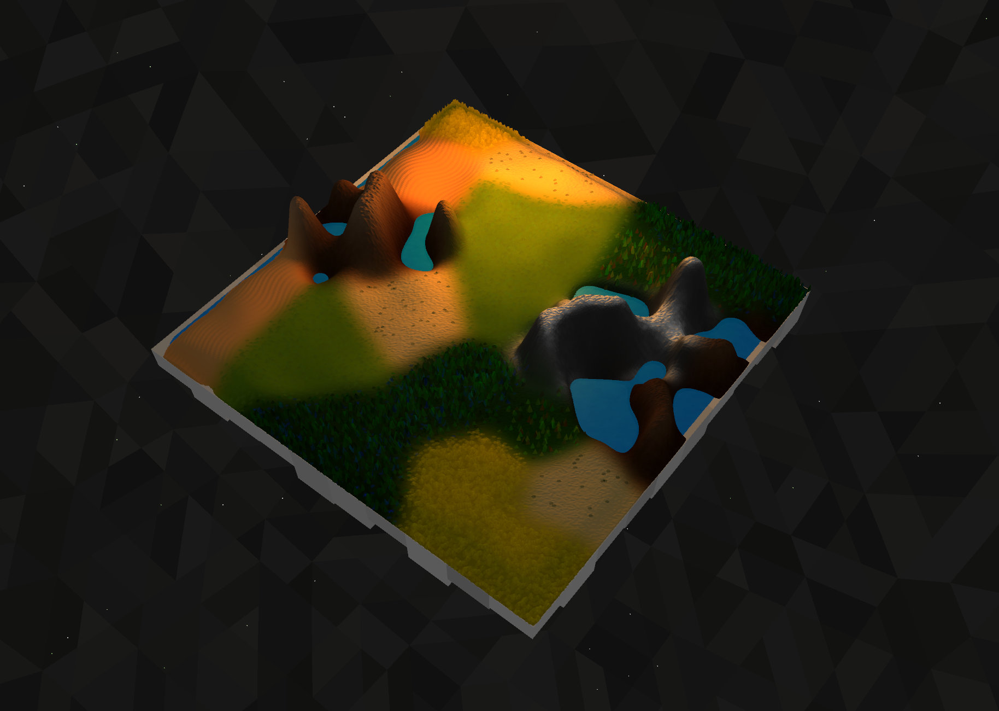
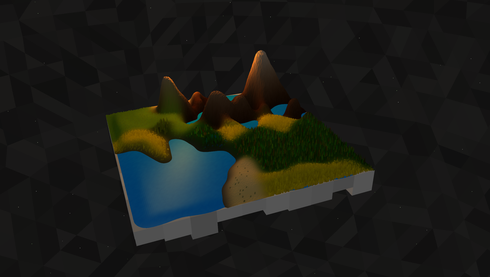
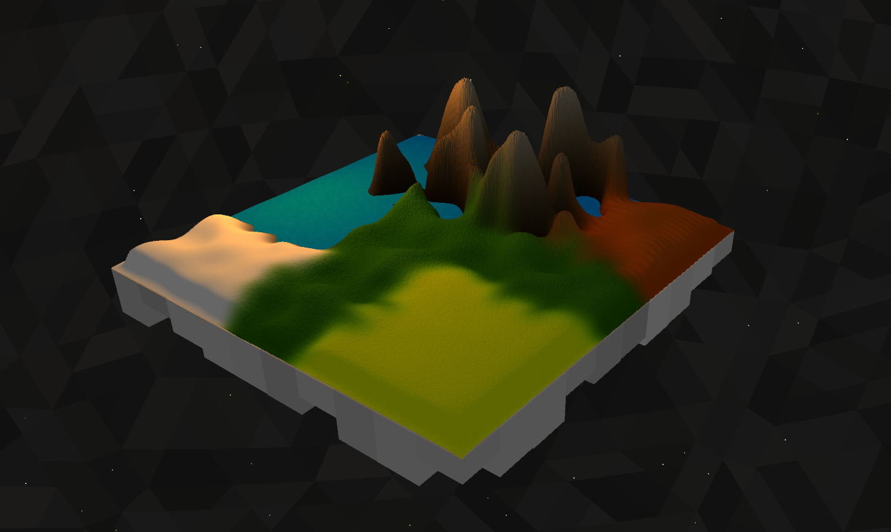
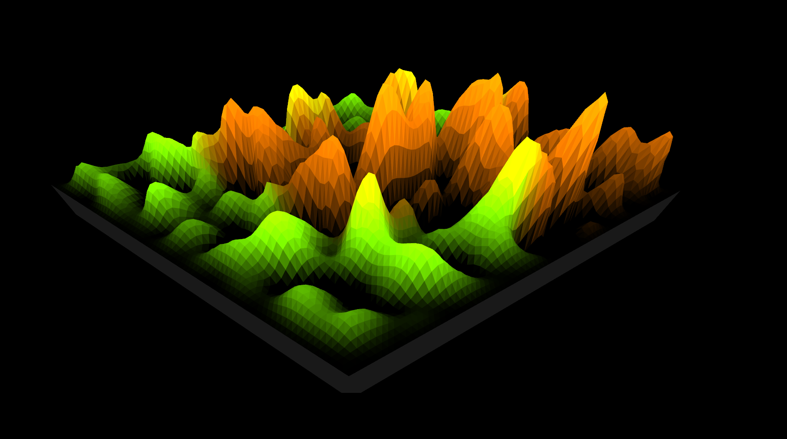

<h1>
   Geoscape
</h1>

Geoscape is a Java application that renders psuedorandom landscapes using OpenGL.

---

#### Repository Layout

 The repository file system is structured in the following way:

| **Directory**                                 |  **Description**       |
| :--------:                                    | :--------:             |
| [assets/](assets)                             |  Asset files           |
| [misc/](misc)                                 |  Timeline snapshots    |
| [src/](src)                                   |  Source code           |

---
### Timeline
#### Snapshot 10 - Flying Camera and Finishing Touches

#### Snapshot 9 - Randomized Landscape and More Biomes

#### Snapshot 8 - Backdrop and Platform 

#### Snapshot 7 - OpenGL Lighting and Water Biome

#### Snapshot 6 - Biome Textures

#### Snapshot 5 - Lighting and Curved Biome Boundaries

#### Snapshot 4 - Point-Based Biomes

#### Snapshot 3 - Multiple Biomes

#### Snapshot 2 - Solid Shading and Water

#### Snapshot 1 - Landscape Mesh

