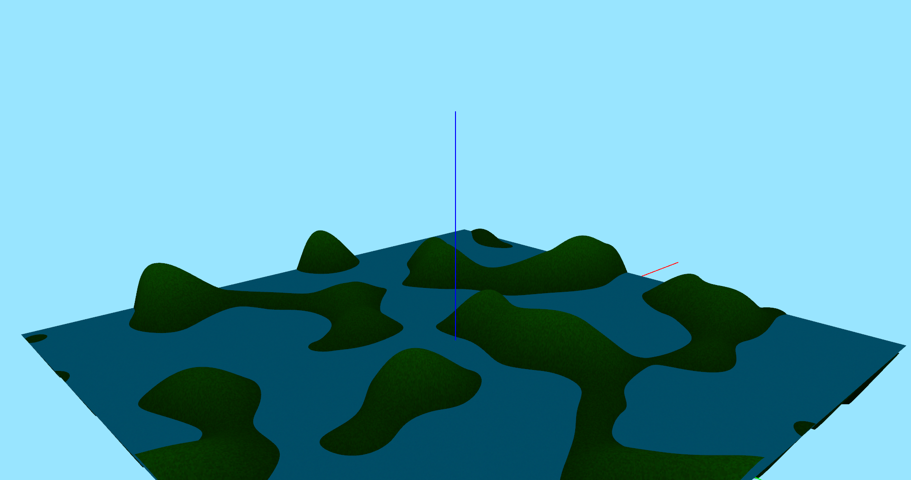

# Geoscape
##### **Author:** Mikhail Andrenkov
---
#### About

 Geoscape is a simple application that uses OpenGL to generate a psuedo-random landscape with Perlin noise.

---
#### Repository Layout

 The repository file system is structured in the following way:  

| **Directory**                                 |  **Description**       |
| :--------:                                    | :--------:             |
| [src/](src)                                   |  Source code           |
| [misc/](misc)                                 |  Miscelleous assets    |
---
### Screenshots
Time Point 3

Time Point 2

Time Point 1

